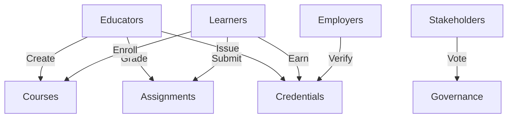

# CoreLoop Educational Blockchain

A comprehensive decentralized education platform built on the Stacks blockchain that enables the creation, distribution, and verification of educational content and credentials.

## Overview

CoreLoop creates a transparent, tamper-proof ecosystem where educational achievements are publicly verifiable yet privately controlled by learners. The platform enables:

- Educators to publish and monetize courses
- Learners to access materials and earn verifiable credentials
- Stakeholders to participate in platform governance
- Direct verification of educational achievements

## Architecture

The platform consists of several interconnected components managing the educational ecosystem:



### Core Components:
- **Education Management**: Handles course creation, enrollment, and content delivery
- **Credential System**: Issues and verifies blockchain-based credentials
- **Assessment Framework**: Manages assignments and grading
- **Governance System**: Enables stakeholder participation in platform decisions

## Contract Documentation

### Main Contract: coreloop-education.clar

Primary contract managing all platform functionality.

#### Key Features:
- Educator registration and course management
- Learner enrollment and assessment
- Credential issuance and verification
- Platform governance and fee management

#### Access Control:
- Admin functions restricted to contract administrator
- Educator functions require educator registration
- Learner functions require learner registration
- Credential access controlled by ownership and permissions

## Getting Started

### Prerequisites
- Clarinet CLI installed
- Stacks wallet for deployment
- Basic understanding of Clarity smart contracts

### Installation
```bash
# Clone the repository
git clone [repository-url]

# Install dependencies
clarinet install

# Run tests
clarinet test
```

## Function Reference

### Educator Functions
```clarity
(register-educator (name (string-ascii 100)) (description (string-utf8 500)))
(create-course (title (string-utf8 100)) (description (string-utf8 1000)) (price uint) (is-subscription bool) (subscription-period uint) (content-uri (string-ascii 500)))
(issue-credential (course-id uint) (learner principal) (title (string-utf8 100)) (description (string-utf8 500)) (expiration-time uint))
```

### Learner Functions
```clarity
(register-learner (name (string-ascii 100)) (email-hash (buff 32)))
(enroll-in-course (course-id uint))
(submit-assignment (course-id uint) (assignment-id uint) (submission-uri (string-ascii 500)))
```

### Administrative Functions
```clarity
(set-admin (new-admin principal))
(set-platform-fee (new-fee uint))
(verify-educator (educator principal))
```

## Development

### Testing
```bash
# Run all tests
clarinet test

# Run specific test file
clarinet test tests/coreloop-education_test.ts
```

### Local Development
1. Start Clarinet console:
```bash
clarinet console
```

2. Deploy contracts:
```bash
clarinet deploy
```

## Security Considerations

### Access Control
- All sensitive functions require appropriate permissions
- Credential access is strictly controlled
- Admin functions are protected

### Data Privacy
- Learner email addresses are stored as hashes
- Credential viewing requires explicit permission
- Private data is not stored on-chain

### Platform Security
- Payment processing includes error handling
- Rate limiting on certain functions
- Credential verification uses cryptographic hashing